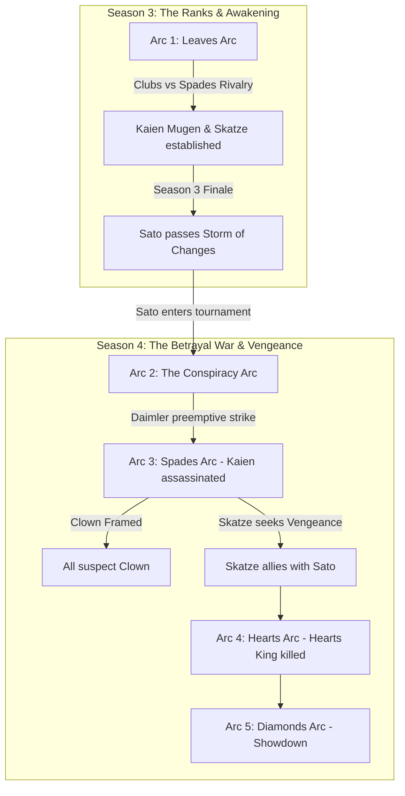

# Lvl 3 Power — Season 1 & 2 Structure & Roster Ideas

This document outlines the narrative division between **Season 3** and **Season 4** (previously labelled Season 1/2 — renumbered 2026-07-13). Under this structure, Season 3 focuses on establishing the baseline conflict, introducing Kaien Mugen and Skatze, and culminating in Sato's entrance. Season 4 contains the escalation of the conspiracy, the assassination of Kaien Mugen, and Sato's tournament climb. Seasons 1 and 2 are prior-era content that precedes this block.

---

## Narrative Architecture

---

## Season 3: The Setup & Ranks

Season 3 introduces the 52-card universe rules, the rivalry between the Clubs and Spades houses, and the entry of the protagonist.

### Season 3 Core Cast
*   **Kaien Mugen (♣ Ace):** The main focus of the Clubs house. Showcases his personality and Lvl 2 Dimensional Split in matchups against the Spades house.
*   **Skatze (Speed — ♠ Ace):** The elite wildcard of the Spades house. Shares a friendly rivalry and mutual respect with Kaien.
*   **Daimler (Sun Dimer/Daimler — ♠ King):** The silent presence leading the Spades house.
*   **Sato (♣ King):** Introduced at the very end of the season as a wildcard human who passes the Storm of Changes and claims the vacant Clubs King card.

### Season 3 Arc Progression
*   **Arc 1: Leaves Arc (Clubs vs Spades):** The active tournament matches establish the spatial and speed abilities of Kaien Mugen and Skatze.
*   **Season 3 Finale (Sato's Introduction):** As the Houses prepare for the next round, an ordinary human on Earth (Sato) unexpectedly undergoes the Shoshinsha ritual, passes the legendary **Storm of Changes** test, and enters the tournament as the new King of Clubs.

---

## Season 4: The Betrayal War

Season 4 transitions the tournament into a deadly faction war driven by the Betrayers' conspiracy, Daimler's preemptive strike, and Sato's climb.

### Season 4 Arc Progression
*   **Arc 2: The Conspiracy Arc:** The tournament resumes. Sato begins climbing the ranks. Daimler and the Betrayers plot their conspiracy, identifying Kaien Mugen's spatial sphere domain as a fatal threat to their goals.
*   **Arc 3: Spades Arc (The Tragedy):** Daimler secretly assassinates Kaien Mugen. The Betrayers frame the Clown (Joker 1) for the murder, drawing collective suspicion onto the Clown. Skatze vows silent vengeance.
*   **Arc 4: Hearts Arc (Power Brawl):** Sato continues his climb. Skatze contacts Sato, allying with him secretly to seek vengeance against Daimler. The King of Hearts confronts the Clown, leading to a H2H stalemate in the Null Realm where the Diamond King kills him. Sato arrives at his final breath.
*   **Arc 5: Diamonds Arc (End of Competition):** Sato's final showdown against the Diamond King, exposing the Betrayers and concluding the tournament. 